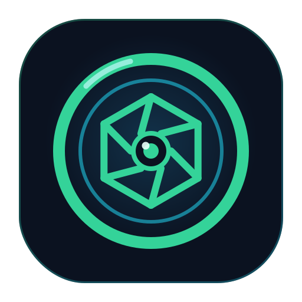

<div align="center">



# iCSee Local Control

**Local-only Android control for iCSee / Xiongmai / XMEye cameras over their native DVRIP protocol — no cloud account, no cloud SDK, no analytics.**

[](https://github.com/voidnullvalue/Icsee-android/actions/workflows/ci.yml)
[](https://github.com/voidnullvalue/Icsee-android/releases/latest)
[](https://github.com/voidnullvalue/Icsee-android/releases)
[](LICENSE)


</div>

---

A greenfield Android app that talks **directly** to an iCSee/Xiongmai/XMEye-family
camera on your LAN over its native DVRIP protocol (TCP 34567) and RTSP — with
**no** iCSee/XMEye/JFTech cloud account, cloud SDK, Firebase, or analytics. Built
and verified against a real camera; every protocol decision is backed by captured
or live-probed bytes documented in [`PROTOCOL_NOTES.md`](PROTOCOL_NOTES.md).


Special thanks goes to my wife foe hitting the reset button on the camera lots of times at odd hours.

## Contents

- [Download](#download)
- [Status](#status)
- [Features](#features)
- [Build from source](#build-from-source)
- [Architecture](#architecture)
- [Documentation](#documentation)
- [What's deliberately not here](#whats-deliberately-not-here)
- [License](#license)

## Download

Grab the latest APK from the [**Releases**](https://github.com/voidnullvalue/Icsee-android/releases/latest)
page and install it directly (enable *install unknown apps* for your browser or
file manager). Builds are produced by CI on every tagged release.

> Release builds are signed with the standard Android **debug** key — fine for
> sideloading, not for Play distribution.

## Status

A real, building, testable application. Verified live against the target camera:

| Capability | Status | Notes |
|---|---|---|
| DVRIP-Web login | ✅ Verified live | Plaintext login; password via the Sofia mod-62 MD5 hash. Real `SessionID`, `Ret: 100`. No RSA/AES needed on this path. |
| PTZ pan / tilt | ✅ Verified live | 8-direction movement and stop confirmed via `Ret` codes (and visible motion on-device). |
| Live video | ✅ Verified live | RTSP (H.265 + PCMA) via `androidx.media3`. DVRIP's own media channel claims OK but delivered no bytes on this camera, so RTSP is the real path. |
| Push-to-talk | ✅ Verified **audible** | Non-obvious: OPTalk *Claim* (1434) returns `Ret: 100` but leaves the speaker shut — a plaintext OPTalk **`Start`** (1430) opens it, then G.711 A-law frames play out loud. |
| BLE Wi-Fi provisioning | ✅ Verified on hardware | App scans, connects, sends Wi-Fi credentials over BLE, and the **camera joins the router**. It drops BLE before reporting its own login, so the app shows the factory `admin` / no-password. |
| Keepalive / reconnect | ✅ Verified live | `1006` keepalive `Ret: 100`; bounded-backoff reconnect. |
| PTZ presets | ✅ Verified live | `OPPTZControl` Set/Goto/Clear preset — `Ret: 100`. |
| Device management | ✅ Verified live | SystemInfo, device time, reboot, and generic get/set of ~any named config (msg 1020/1042/1040). |
| Username change | ✅ Verified live | `ModifyUser` (msg 1484) renames the account; re-login under the new name confirmed. |
| Password change | ⛔ Not offered | Mechanism fully reverse-engineered (plaintext `ModifyPassword` + `System.ExUserMap`, see below) but the device has an **unremovable blank-`admin` LAN backdoor** that makes it moot. See [`SECURITY.md`](SECURITY.md). |
| SD format / recordings list | 🟡 Built from spec | `OPStorageManager` format and `OPFileQuery` clip listing built from the decompiled vendor shapes; not yet confirmed against a live reply. Recorded-video *playback* is blocked by the same DVRIP media-byte gap as live view. |
| LAN discovery | 🟡 Partial | Client probe frame byte-verified; beacon-response parsing implemented but not observed on this camera. |

Full evidence and the honest caveats live in [`PROTOCOL_STATUS.md`](PROTOCOL_STATUS.md).

> **Device security note:** this camera exposes an `admin` account with a blank
> password that always authenticates over DVRIP on the LAN and cannot be
> secured — configured passwords are ignored for it. This is a firmware defect
> (classic Xiongmai default account), documented with evidence in
> [`SECURITY.md`](SECURITY.md). The app therefore does not pretend to "secure"
> the device.

## Features

- 📡 **LAN discovery** — UDP beacon probe + parsing, bounded window, multicast lock
- 🌐 **VPN discovery** — unicast subnet sweep that validates DVRIP, for cameras reached over WireGuard/routed tunnels
- 🔐 **Confirmed plaintext DVRIP-Web login** — Sofia hash, verified end-to-end
- ♻️ **Session state machine** — keepalive + bounded-backoff reconnect
- 🎮 **PTZ** — 8-direction press-and-hold pad, stop-on-release, adjustable speed, **presets** (tap-recall / hold-save)
- 🎥 **Live video** — RTSP (H.265 + PCMA) via `androidx.media3` / `PlayerView`; **full-screen drag-to-steer** PTZ
- 🎙️ **Push-to-talk** — dedicated talk connection, OPTalk Claim + Start handshake, G.711 A-law upstream
- 📶 **BLE pairing / Wi-Fi provisioning** — scanner + GATT choreography matched to the factory app; fast connection interval to better capture the provisioning ACK
- 🛠️ **Device management** — device info, time, reboot, **username change**, and a generic get/set editor for any named DVRIP config
- 📖 **Plain-English config docs** — cryptic protocol keys shown with friendly labels + descriptions + decoded on/off values
- 🖼️ **Friendly Image settings** — flip / mirror / gain / day-night as real controls instead of raw hex
- 💾 **SD card** — status, format (confirm-gated), and a recorded-clip browser
- 🔓 **Reveal-password** toggles on every password field
- 🌙 **Dark, touch-first** Jetpack Compose UI
- 🩺 **Sanitized diagnostics** screen — never shows credentials or keys

## Using over a VPN (WireGuard)

The app works against a camera reached through a routed VPN (e.g. WireGuard,
phone → home router), with two things to know:

- **Discovery** — the normal LAN discovery uses a UDP **broadcast**, which does
  not cross a routed tunnel. Use **"Scan subnet (VPN)"** on the camera list
  instead: enter the camera's subnet (e.g. `192.168.88`) and it sweeps the
  `/24` by unicast, keeping only hosts that return a valid DVRIP response. (A
  plain port scan is unreliable here — some routers/VPN endpoints ACK
  connections for the whole subnet, so the sweep validates the DVRIP protocol,
  not just an open port.) Adding a camera **by IP** always works too.
- **Reliability** — if the tunnel connects then goes idle, set
  `PersistentKeepalive = 25` on the peer and exclude both the WireGuard app and
  iCSee from Android battery optimization. For smooth RTSP video, lower the
  client `MTU` to ~`1280` (WireGuard's overhead otherwise silently drops large
  video packets). Make sure the peer's `AllowedIPs` includes the camera subnet.

## Build from source

```bash
./gradlew testDebugUnitTest assembleDebug
# → app/build/outputs/apk/debug/app-debug.apk
```

Requirements: JDK 17, Android SDK 36. CI ([`.github/workflows/ci.yml`](.github/workflows/ci.yml))
runs the unit tests, lint, and a debug assemble on every push and PR.

Developing on ARM64 (Termux/proot)? See [`BUILDING_IN_PROOT.md`](BUILDING_IN_PROOT.md)
for the aapt2-under-QEMU toolchain. Live-probe credentials go in the gitignored
`local-test.properties` (see `local-test.properties.example`).

## Architecture

```
app/src/main/kotlin/com/voidnullvalue/icseelocal/
  ui/          Compose screens + ViewModels (camera list, settings, live, diagnostics, BLE,
               device management, generic config editor, image settings, recordings) + theme
  model/       CameraDescriptor, ConnectionState state machine
  discovery/   UDP beacon probe/parsing, multicast lock
  dvrip/       20-byte header framing, frame assembler, TCP transport, message-id catalog
  crypto/      Sofia password hash, RSA public-key parsing, AES SessionCrypto
  config/      Generic named-config get/set channel, field constraint metadata, field docs
  session/     Login negotiator, session manager, keepalive, reconnect backoff, command channel
  ptz/         OPPTZControl JSON builder, press-and-hold controller
  video/       RTSP player, media stream reassembly, codec probe, snapshot capture
  audio/       G.711 A-law codec, talk-frame wrapping, microphone capture, talk controller
  ble/         BLE scanner (manufacturer-data beacon match), pairing/Wi-Fi provisioning client + codec
  storage/     Keystore-backed credential storage, DataStore for non-sensitive prefs
```

## Documentation

| Doc | What's in it |
|---|---|
| [`PROTOCOL_NOTES.md`](PROTOCOL_NOTES.md) | The evidence — pcap + live findings, with exact bytes |
| [`PROTOCOL_STATUS.md`](PROTOCOL_STATUS.md) | Feature-by-feature verified/blocked status |
| [`PASSWORD_CHANGE_RE.md`](PASSWORD_CHANGE_RE.md) | How credential change works on this firmware (plaintext `ModifyPassword` + `System.ExUserMap`) and why the backdoor makes it moot |
| [`BUILDING_IN_PROOT.md`](BUILDING_IN_PROOT.md) | ARM64 toolchain setup details |
| [`TESTING.md`](TESTING.md) | Unit tests + opt-in live hardware tests |
| [`SECURITY.md`](SECURITY.md) | Threat model, the blank-`admin` backdoor finding, crypto/credential-storage choices |

## What's deliberately not here

No iCSee/XMEye/JFTech cloud SDK, no Firebase, no analytics/ads SDKs, no
Flutter/React Native/WebView wrapper, no custom crypto primitives, and no
hardcoded credentials.

## License

[MIT](LICENSE) © 2026 |VOID|

For use with cameras you own or are authorized to control on your own network.
DVRIP protocol details here were determined by observing traffic to/from a
camera under the author's control.
